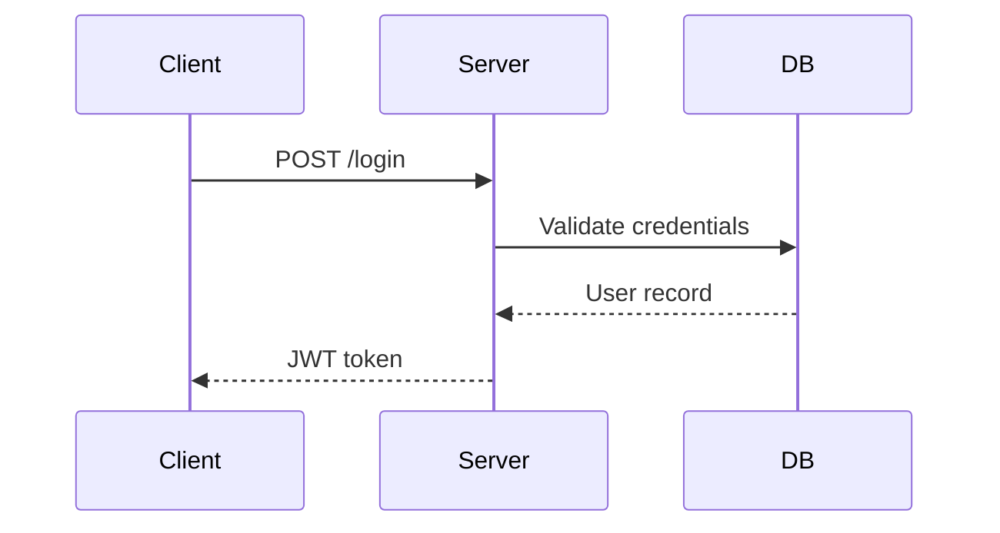

# Slidev Interactive Demos

Guide for embedding interactive demos, mock UIs, and animated workflows in Slidev presentations.

## Two Integration Paths

Choose based on portability and integration requirements:

| Concern | Vue Components | Iframe / HTML5 |
|---------|---------------|----------------|
| Slidev integration | Tight — shares state, `v-click`, themes | Loose — isolated sandbox |
| Portability | Requires Slidev project | Self-contained HTML file |
| Reactivity | Full Vue 3 reactivity | Vanilla JS or any framework |
| Styling | Inherits slide theme | Independent CSS |
| Hot reload | Yes (Vite HMR) | Requires manual refresh |
| Best for | Demos that respond to clicks, slide context | Standalone prototypes, third-party widgets |

For Vue component patterns, see `references/vue-components.md`.
For iframe and standalone HTML patterns, see `references/iframe-mocks.md`.
For animation patterns, see `references/animation-patterns.md`.

## Vue Component Path

### Auto-Import

Place `.vue` files in `components/` — Slidev auto-imports them by filename:

```
components/
├── LoginForm.vue
├── ApiExplorer.vue
└── DashboardWidget.vue
```

Use directly in slides without import statements:

```markdown
---
layout: default
---

# Live Demo

<LoginForm />
```

### Reactive State with Vue 3

Use the Composition API for state management:

```vue
<script setup>
import { ref, computed } from 'vue'

const step = ref(0)
const steps = ['Input', 'Validate', 'Submit', 'Success']
const currentStep = computed(() => steps[step.value])

function advance() {
  if (step.value < steps.length - 1) step.value++
}
function reset() {
  step.value = 0
}
</script>
```

### Integration with v-click

Wrap components in `v-click` for progressive reveal, or use `$clicks` for step-aware behavior:

```markdown
<v-click>
  <ApiExplorer />
</v-click>

<!-- Or bind clicks inside the component -->
<WorkflowDemo :step="$clicks" />
```

Inside the component, receive `step` as a prop and render accordingly:

```vue
<script setup>
const props = defineProps({ step: { type: Number, default: 0 } })
</script>

<template>
  <div class="workflow">
    <StepItem v-for="(s, i) in steps" :key="i"
              :active="i === props.step"
              :done="i < props.step" />
  </div>
</template>
```

### Scoped Styles

Use `<style scoped>` to prevent leaking styles into the slide:

```vue
<style scoped>
.demo-container {
  border: 1px solid #e2e8f0;
  border-radius: 8px;
  padding: 1.5rem;
}

.active-step {
  background: var(--slidev-theme-primary, #4f46e5);
  color: white;
}
</style>
```

### Slide-Aware Behavior with $slidev

Access navigation state inside components using the `useSlideContext` composable:

```vue
<script setup>
import { useSlideContext } from '@slidev/client'

const { $slidev } = useSlideContext()

// Current slide number
const slideNo = computed(() => $slidev.nav.currentPage)

// Total clicks on this slide
const clicks = computed(() => $slidev.nav.clicks)

// Check if presenting (vs. browsing)
const isPresenting = computed(() => $slidev.nav.isPresenter)
</script>
```

## Iframe / HTML5 Path

### Directory Structure

Place self-contained mocks in `public/mocks/`:

```
public/
└── mocks/
    ├── dashboard/
    │   ├── index.html
    │   ├── style.css
    │   └── app.js
    └── login-flow/
        └── index.html   # inline CSS/JS preferred for portability
```

### Slidev iframe Layouts

Use built-in layouts to embed mocks:

```markdown
---
layout: iframe
url: /mocks/dashboard/index.html
---
```

Split layouts for side-by-side content:

```markdown
---
layout: iframe-right
url: /mocks/login-flow/index.html
---

## Login Flow

Walk through the authentication steps:

1. User enters credentials
2. Client validates format
3. Server returns JWT
4. Redirect to dashboard
```

### Importing Existing Mocks

To embed an existing standalone HTML prototype:

1. Copy the mock to `public/mocks/<name>/`
2. Fix relative asset paths — all paths must work from `/mocks/<name>/index.html`
3. Bundle external CSS/JS inline or copy dependencies into the mock directory
4. Reference via `url: /mocks/<name>/index.html` in slide frontmatter

Asset path checklist:
- `./style.css` works when `style.css` is in the same directory
- `../shared/reset.css` works if the `shared/` directory is within `public/`
- Absolute CDN URLs work if network is available during presentation
- Prefer inline styles/scripts for fully offline presentations

### postMessage Communication

Send data from the iframe to the parent slide:

```javascript
// Inside the mock (iframe)
function notifyParent(event, payload) {
  window.parent.postMessage({ event, payload }, '*')
}

// Example: notify parent when user completes a step
document.querySelector('#submit-btn').addEventListener('click', () => {
  notifyParent('form-submitted', { user: 'demo@example.com' })
})
```

Listen in the slide (embed in a Vue component):

```vue
<script setup>
import { onMounted, onUnmounted, ref } from 'vue'

const lastEvent = ref(null)

function handleMessage(e) {
  if (e.data?.event) lastEvent.value = e.data
}

onMounted(() => window.addEventListener('message', handleMessage))
onUnmounted(() => window.removeEventListener('message', handleMessage))
</script>
```

## Common Mock Templates

### Login Flow

Demonstrate authentication UX with three states: input, loading, success.

```vue
<!-- components/LoginDemo.vue -->
<script setup>
import { ref } from 'vue'
const state = ref('idle') // idle | loading | success | error
const email = ref('')
const password = ref('')

async function submit() {
  state.value = 'loading'
  await new Promise(r => setTimeout(r, 1200))
  state.value = email.value.includes('@') ? 'success' : 'error'
}
</script>

<template>
  <form class="login-demo" @submit.prevent="submit"
        aria-label="Login demonstration form">
    <div v-if="state === 'success'" role="status" aria-live="polite">
      Signed in as {{ email }}
    </div>
    <template v-else>
      <label for="demo-email">Email</label>
      <input id="demo-email" v-model="email" type="email"
             :disabled="state === 'loading'"
             aria-required="true" />
      <label for="demo-password">Password</label>
      <input id="demo-password" v-model="password" type="password"
             :disabled="state === 'loading'"
             aria-required="true" />
      <button type="submit" :disabled="state === 'loading'"
              :aria-busy="state === 'loading'">
        {{ state === 'loading' ? 'Signing in…' : 'Sign in' }}
      </button>
      <p v-if="state === 'error'" role="alert" class="error">
        Invalid email address — include an @ symbol
      </p>
    </template>
  </form>
</template>
```

### Dashboard Widget

Display metric cards with live-updating values:

```vue
<script setup>
import { ref, onMounted, onUnmounted } from 'vue'
const metrics = ref([
  { label: 'Requests/s', value: 0 },
  { label: 'Error rate', value: 0 },
  { label: 'P95 latency', value: 0, unit: 'ms' },
])
let interval

onMounted(() => {
  interval = setInterval(() => {
    metrics.value[0].value = Math.floor(800 + Math.random() * 400)
    metrics.value[1].value = (Math.random() * 2).toFixed(2)
    metrics.value[2].value = Math.floor(45 + Math.random() * 60)
  }, 1500)
})
onUnmounted(() => clearInterval(interval))
</script>

<template>
  <div class="dashboard" role="region" aria-label="Live metrics dashboard">
    <div v-for="m in metrics" :key="m.label"
         class="metric-card" aria-live="polite" aria-atomic="true">
      <span class="label">{{ m.label }}</span>
      <span class="value">{{ m.value }}<span v-if="m.unit" class="unit">{{ m.unit }}</span></span>
    </div>
  </div>
</template>
```

### API Request/Response

Show an HTTP interaction step by step:

```vue
<script setup>
import { ref } from 'vue'
const phase = ref('idle') // idle | request | response | error
const responseData = ref(null)

async function sendRequest() {
  phase.value = 'request'
  await new Promise(r => setTimeout(r, 900))
  responseData.value = { id: 42, name: 'Widget', status: 'active' }
  phase.value = 'response'
}
</script>

<template>
  <div class="api-demo" role="region" aria-label="API request demonstration">
    <div class="request-panel">
      <code>GET /api/widgets/42</code>
      <button @click="sendRequest" :disabled="phase === 'request'">Send</button>
    </div>
    <div v-if="phase !== 'idle'" class="response-panel"
         aria-live="polite" :aria-busy="phase === 'request'">
      <span v-if="phase === 'request'">Sending…</span>
      <pre v-else>{{ JSON.stringify(responseData, null, 2) }}</pre>
    </div>
  </div>
</template>
```

### Multi-Step Wizard

```vue
<script setup>
import { ref, computed } from 'vue'
const steps = ['Account', 'Profile', 'Review', 'Done']
const current = ref(0)
const isLast = computed(() => current.value === steps.length - 1)

function next() { if (!isLast.value) current.value++ }
function back() { if (current.value > 0) current.value-- }
</script>

<template>
  <div class="wizard" role="region" aria-label="Multi-step form">
    <nav aria-label="Progress">
      <ol>
        <li v-for="(s, i) in steps" :key="s"
            :aria-current="i === current ? 'step' : undefined">
          {{ s }}
        </li>
      </ol>
    </nav>
    <div :key="current" class="step-content">
      <h3>Step {{ current + 1 }}: {{ steps[current] }}</h3>
      <p>Demo content for {{ steps[current] }} step.</p>
    </div>
    <div class="wizard-nav">
      <button @click="back" :disabled="current === 0">Back</button>
      <button @click="next" :disabled="isLast">
        {{ isLast ? 'Finish' : 'Next' }}
      </button>
    </div>
  </div>
</template>
```

## Mermaid + Interactive Demo Pairing

Pair a Mermaid workflow diagram with an interactive demo — diagram shows structure, demo lets audience walk through it.

```markdown
---
layout: two-cols
---

## Auth Flow Diagram



- Client sends credentials over HTTPS
- Server validates against hashed password in DB
- JWT issued with 24h expiry and refresh token
- Client stores JWT in memory (not localStorage)

::right::

## Try It Live

<LoginDemo />
```

Always add annotation bullets below each Mermaid block:
- Explain what each arrow or node represents
- Call out constraints, failure modes, or non-obvious design decisions
- Relate diagram elements to real code or infrastructure

## Accessibility Requirements

All interactive demos must meet these requirements. Load `core:accessibility` for full WCAG guidance.

### Keyboard Navigation

- All interactive controls (buttons, inputs, links) reachable via Tab
- Custom interactive elements use `tabindex="0"` and handle `keydown` for Enter/Space
- Focus moves logically through the demo without trapping (unless intentional modal)
- Provide a visible focus indicator — do not remove CSS `outline` without a replacement

```vue
<div role="button" tabindex="0"
     @click="activate"
     @keydown.enter="activate"
     @keydown.space.prevent="activate">
  Activate
</div>
```

### ARIA Roles and Live Regions

- Use `role="region"` with `aria-label` on demo containers
- Use `aria-live="polite"` for updates that don't interrupt (metric changes, status)
- Use `aria-live="assertive"` only for critical errors requiring immediate attention
- Use `role="alert"` for error messages
- Use `role="status"` for success confirmations
- Mark decorative elements with `aria-hidden="true"`

### Form Controls

- Every input must have an associated `<label>` via `for`/`id` or `aria-label`
- Required fields use `aria-required="true"`
- Loading states use `aria-busy="true"` on the button or container
- Error messages use `aria-describedby` to link error text to its input

### Color Contrast

- Text must meet 4.5:1 contrast ratio against background (WCAG AA)
- Interactive component borders and focus indicators must be visible
- Never use color alone to convey state — pair with text, icon, or pattern

### Animation and Motion

- Wrap animations in `@media (prefers-reduced-motion: reduce)` checks
- Provide non-animated fallback for all transitions
- Avoid content that flashes more than 3 times per second

See `references/animation-patterns.md` for motion-safe animation examples.

## Export Considerations

- Vue components render during PDF/PPTX export — use `$slidev.nav.isPresenter` to detect export mode and disable timers
- Iframes do not render in exported PDFs — add a static screenshot or description as fallback
- Use `<v-if="!$slidev.nav.isExporting">` to hide demo-only elements from exports

## References

- `references/vue-components.md` — Detailed Vue 3 component patterns, worked examples
- `references/iframe-mocks.md` — Standalone HTML5 mock patterns and postMessage examples
- `references/animation-patterns.md` — CSS transitions, Vue Transition, reduced-motion patterns
