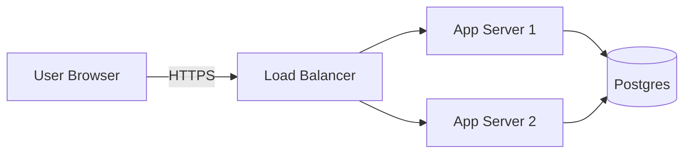

# Presentation Strategy and Best Practices

Structured frameworks for planning, structuring, and designing effective presentations for any audience.

## When to Use This Skill

Activate when:
- Planning the structure or narrative of a slide deck
- Choosing how to frame a problem or recommendation
- Adapting a presentation for developers, executives, or mixed audiences
- Designing a one-pager (executive summary or single-slide overview)
- Applying presentation design principles (rule of threes, assertion-evidence, cognitive load)
- Reviewing or critiquing a slide deck's structure or messaging

## Core Frameworks

### Problem-First Framing (Pyramid Principle)

Lead with the answer or recommendation first, then supporting evidence. Never open with "how we did it" — open with "what the problem is and what we recommend."

**SCQA Structure:**
1. **Situation** — the stable context the audience already knows
2. **Complication** — what changed or went wrong
3. **Question** — the question the complication raises
4. **Answer** — the recommendation (state this first, then support it)

Apply SCQA to the opening slide before revealing methodology or detail.

See `references/frameworks.md` for worked SCQA examples and Pyramid Principle depth.

### Rule of Threes

Limit each presentation to 3 key messages. Structure each key message with 3 supporting arguments. Use a 3-act arc: setup → confrontation → resolution.

- Cognitive basis: working memory handles 3 items reliably
- Apply at the deck level (3 sections) and the slide level (3 bullets max)
- When you have more than 3 points, find the grouping pattern, not more slides

### Assertion-Evidence Slide Design

Every slide follows this structure:
- **Top of slide**: A single declarative assertion — 2 lines maximum, ~10-15 words
- **Body**: Visual evidence supporting the assertion (diagram, chart, image, table)
- Target ~20 words total per slide (assertion + any labels)
- Replace bullet lists with visual evidence wherever possible

**Bad assertion (topic label):** "Q3 Performance"
**Good assertion (claim):** "Q3 latency dropped 40% after cache rollout"

### Guy Kawasaki 10/20/30 Rule

- Maximum **10 slides** per deck
- Maximum **20 minutes** of speaking time
- Minimum **30pt** font size

Apply as a constraint check after structuring the deck. If a draft exceeds 10 slides, identify which slides can merge, become appendix, or be cut.

### Nancy Duarte Sparkline

Frame the narrative as a contrast between "what is" (current reality) and "what could be" (future vision). Make the audience the hero of the transformation, not the presenter or product.

Arc: begin at "what is" → rise through "what could be" → call to action.

### Presentation Zen Principles

1. **Simplicity** — remove everything that does not serve the message
2. **Clarity** — one idea per slide, no ambiguity
3. **Restraint** — fewer elements, more impact
4. **Harmony** — visual consistency across all slides
5. **Connection** — design for the audience, not the presenter

## Diagram Annotation Requirement

Every mermaid diagram and every `.jsx` page component MUST include:
- Accompanying bullet points or a legend explaining each block/node/element
- `%%` comment annotations inside the mermaid code block for each major element
- A `note` block or annotation slide immediately following complex diagrams

No orphan diagrams. A diagram without explanation is inaccessible to any audience.

**Example mermaid with required annotations:**

```


- **User Browser**: Client entry point, all traffic over HTTPS
- **Load Balancer**: Round-robin distribution, no sticky sessions
- **App Server 1/2**: Stateless instances, horizontally scalable
- **Postgres**: Single primary, read replicas not shown
```

## Audience Routing

Detect audience type from context clues (job titles, meeting name, stated goals) and route to the appropriate template guidance.

| Audience | Primary Driver | Template |
|----------|---------------|----------|
| Developers / Engineers | Technical correctness, design rationale | `references/audience-templates.md` → Developer section |
| Non-Technical Stakeholders | Business impact, ROI, clear ask | `references/audience-templates.md` → Stakeholder section |
| Mixed (technical + business) | Progressive disclosure by layer | `references/audience-templates.md` → Mixed section |
| Executive (C-suite) | Decision, risk, cost, timeline | Apply 10/20/30 + Pyramid Principle strictly |

See `references/audience-templates.md` for content structure, tone, and visual approach per audience.

## One-Pager Selection

Choose format based on delivery context:

- **Executive Summary PDF** (`references/one-pagers.md`): Multi-section document, printed or emailed. Use when the audience reads before the meeting or when no live presentation occurs.
- **Single-Slide Overview** (`references/one-pagers.md`): Dense single slide designed for sharing or screen display. Use when the deck will be referenced live or dropped into a chat.

See `references/one-pagers.md` for structure and design guidance for both formats.

## Cognitive Load Principles

- One idea per slide — if two ideas compete, split the slide
- Progressive disclosure — reveal information in the order the audience needs it
- Visual hierarchy — the most important element dominates (size, position, color)
- Whitespace — empty space is not wasted space; it reduces cognitive noise
- Consistency — use the same visual language for the same type of information throughout

## Deck Checklist

Before finalizing any presentation:

1. Does the first slide state the problem and recommendation? (Pyramid Principle)
2. Are there 3 or fewer key messages? (Rule of Threes)
3. Does each slide have a declarative assertion at the top? (Assertion-Evidence)
4. Are all diagrams annotated? (Diagram Annotation Requirement)
5. Does font size stay at or above 30pt? (Kawasaki)
6. Does the narrative contrast current state with future state? (Duarte Sparkline)
7. Is every element on each slide earning its place? (Presentation Zen)

## Templates

Ready-to-use Slidev markdown templates are in `templates/`:

- `developer-deck.md` — Technical audience deck with architecture diagrams and code walkthrough
- `stakeholder-deck.md` — Business audience deck with ROI and call-to-action structure
- `executive-summary.md` — One-pager export template for PDF
- `single-slide-overview.md` — Dense single slide for sharing

## References

- `references/frameworks.md` — Pyramid Principle, SCQA, Assertion-Evidence, Duarte Sparkline, Presentation Zen depth
- `references/audience-templates.md` — Per-audience content structure, tone, and visual approach
- `references/one-pagers.md` — Executive summary PDF and single-slide overview formats
