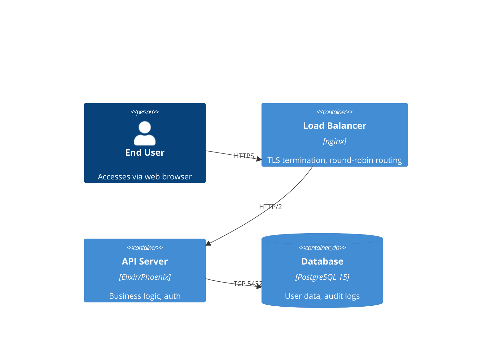
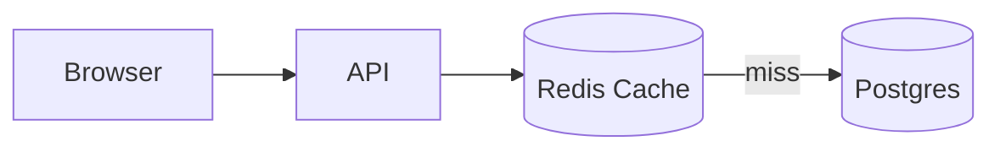

# Audience Templates Reference

Content structure, tone, and visual approach for each audience type.

## Table of Contents

1. [Developers / Engineers](#developers--engineers)
2. [Non-Technical Stakeholders](#non-technical-stakeholders)
3. [Mixed Audiences](#mixed-audiences)
4. [Quick Routing Reference](#quick-routing-reference)

---

## Developers / Engineers

### Audience Characteristics

- Values technical correctness over polish
- Reads code faster than prose
- Skeptical of marketing language and vague claims
- Wants to understand design decisions, not just outcomes
- Comfortable with complexity when it is explained systematically

### Content Structure

```
Slide 1: Problem Statement (technical)
  - What is broken, slow, or missing — with specific metrics
  - System context (not business context)

Slide 2: Constraints
  - Non-negotiable constraints (latency, consistency, security)
  - Tradeoffs being made explicitly

Slide 3: Architecture Overview (C4 Level 2 or 3)
  - Diagram with annotated elements
  - Data flow labeled

Slides 4-6: Design Decisions
  - One decision per slide
  - Assertion: "We chose X over Y because Z"
  - Evidence: benchmark, failure mode comparison, or specification reference

Slide 7: Implementation Plan
  - Phase breakdown with milestones
  - Dependencies called out

Slide 8: Open Questions / Risks
  - What is not decided yet
  - What could go wrong and mitigation

Slide 9 (optional): Code Walkthrough
  - Key function signatures or API contracts
  - Use Slidev code blocks with line highlighting
```

### Tone Guidelines

- Direct and precise — no hedging
- State tradeoffs explicitly: "This approach sacrifices consistency for availability"
- Cite sources for claims: "Per the Postgres docs on MVCC..." or "Benchmark run on m5.xlarge..."
- Avoid: "seamless", "powerful", "simple", "easy", "just"
- Use: specific version numbers, benchmark results, error rates, latency percentiles

### Visual Approach

- **Architecture diagrams**: C4 model levels — Context (L1), Container (L2), Component (L3)
- **Code blocks**: Monospace font, minimum 16pt, syntax highlighted
- **Data visualization**: Latency histograms, throughput graphs, error rate timelines
- **Tables**: Side-by-side comparison of design alternatives with specific criteria
- **Sequence diagrams**: For request flows involving multiple services

### C4 Diagram Annotation Pattern

Every C4 diagram requires annotation for each element:

```


- **End User**: Browser client, no direct backend access
- **Load Balancer**: nginx, handles TLS termination and health checks
- **API Server**: Stateless Phoenix application, scales horizontally
- **Database**: PostgreSQL 15, single primary, read replicas not shown
```

### Code Slide Pattern

Use Slidev's line highlighting to guide attention:

```markdown
---
layout: default
---

## Request Authentication Flow

Top assertion: "JWT validation happens at the router layer before any business logic"

```elixir {1-3|5-8|10-12}
# Router plug pipeline — validates JWT before controller
pipeline :api do
  plug MyApp.Auth.JWTPlug  # Line 1-3: auth happens here

  # Lines 5-8: only reached if JWT is valid
  plug :accepts, ["json"]
  plug :fetch_session
  plug MyApp.RateLimiter
end

# Lines 10-12: controller has no auth code — separation of concerns
def show(conn, %{"id" => id}) do
  user = Users.get!(id)
end
```

- Lines 1-3: JWT validation via `JWTPlug` — returns 401 on failure, never reaches controller
- Lines 5-8: Secondary plugs run only after auth passes
- Lines 10-12: Controller is auth-free — single responsibility
```

---

## Non-Technical Stakeholders

### Audience Characteristics

- Decision-makers: budget owners, business unit leads, product owners
- Time-constrained — deck may be read without a presenter
- Primary question: "What does this cost/save/enable for the business?"
- Secondary question: "What do I need to approve?"
- Risk-averse — wants to understand what could go wrong and how it is mitigated

### Content Structure

```
Slide 1: Problem / Opportunity (business framing)
  - The cost or risk of the current state
  - Use business metrics (revenue, cost, customer impact)

Slide 2: Proposed Solution (outcome-first)
  - What changes and what the audience gains
  - No technical implementation detail

Slide 3: Business Impact
  - ROI projection with methodology stated
  - Time-to-value clearly labeled
  - Comparison: cost of action vs cost of inaction

Slide 4: Implementation Plan (simplified)
  - 3-phase timeline at most
  - Key milestones the audience cares about (go-live, first value delivery)
  - Dependencies that require stakeholder action called out explicitly

Slide 5: Risks and Mitigations
  - Top 3 risks only
  - Each with a stated mitigation
  - Avoid technical jargon in risk descriptions

Slide 6: Call to Action
  - Single clear ask
  - Decision deadline if relevant
  - Next steps if approved
```

### Tone Guidelines

- Lead with outcomes, not activities: "Customers see 50% faster load times" not "We optimized the database"
- Use concrete numbers: "$120K annual savings" not "significant cost reduction"
- Avoid technical jargon — define any term used
- One ask per slide — do not bury the call to action
- Match vocabulary to the audience's domain: "customer satisfaction", "retention rate", "time to market"

### Visual Approach

- **ROI visualization**: Simple before/after bar chart or cost comparison table
- **Timeline**: Gantt-style with milestone labels, not technical sprint breakdowns
- **Impact metrics**: Large-number callouts ("$400K / year") with supporting context underneath
- **Process flow**: High-level swimlane, no technical component details
- **Risk matrix**: Simple 2x2 (likelihood × impact) with top 3 risks plotted

### Business Impact Slide Pattern

```
Assertion: "Migration reduces infrastructure cost by $400K/year starting in Q3"

[Chart: Current annual cost $640K | Post-migration $240K | Savings $400K]
[Timeline bar: 8-month migration | Full savings begin Month 9]

- Methodology: AWS TCO calculator + current Azure billing (3-month average)
- Excludes one-time migration cost of $80K (see Slide 4)
- Payback period: 2.4 months after migration completes
```

### Call to Action Slide Pattern

```
Assertion: "Approve the $80K migration budget to begin Phase 1 in March"

[Single action box]
Decision needed: Budget approval by February 15

If approved:
→ Phase 1 kickoff: March 3
→ First workloads migrated: April 30
→ Full migration complete: October 31
→ Cost savings begin: November 1

Questions: [owner name, contact]
```

---

## Mixed Audiences

### Audience Characteristics

- Room contains both technical contributors and business decision-makers
- Technical attendees need enough depth to assess feasibility
- Business attendees need enough clarity to approve and fund
- Neither group should feel ignored or condescended to

### Progressive Disclosure Strategy

Structure the deck in layers:
- **Layer 1 (top)**: Business impact and recommendation — visible to all
- **Layer 2 (middle)**: High-level technical approach — accessible to both audiences
- **Layer 3 (bottom)**: Technical depth — detailed in appendix or reference slides

### Content Structure

```
Slide 1: Recommendation (Pyramid Principle top)
  - State the recommendation and business impact together
  - "We recommend X, which will reduce Y by Z"

Slide 2: Problem (both audiences can engage)
  - Business framing: cost/risk/opportunity
  - Technical framing: what is breaking and why (1-2 sentences only)

Slide 3: Solution Overview (high-level)
  - Architecture diagram at C4 Level 1 (context only, no internals)
  - Business outcome labeled on diagram

Slides 4-5: Business Case
  - Identical to Non-Technical Stakeholder pattern
  - Technical detail deferred to appendix

Slides 6-7: Technical Approach (accessible depth)
  - C4 Level 2 diagram with annotated elements
  - Key design decisions stated as assertions
  - Technical details in presenter notes, not slide body

Slide 8: Plan and Ask
  - Timeline and call to action

Appendix: Technical Deep Dive
  - Full C4 diagrams, sequence diagrams, code examples
  - For technical attendees who want depth post-meeting
```

### Expandable Section Pattern

Use Slidev's click animations to progressively reveal technical depth during live presentation:

```markdown
---
clicks: 2
---

## Solution Architecture

<v-click at="0">

**Business view**: Users get faster checkout — average 2s reduction in load time

</v-click>

<v-click at="1">

**Technical view**: Redis cache layer added between API and Postgres reduces read query load by 70%

</v-click>

<v-click at="2">


- **Redis Cache**: Read-through, 5-minute TTL on product data
- **Postgres**: Only queried on cache miss — ~30% of requests at current hit rate
</v-click>
```

### Tone Guidelines for Mixed Rooms

- State the business impact first on every slide
- Follow immediately with the technical mechanism (one sentence)
- Never assume the technical attendees will explain to the business attendees
- Use analogies to bridge: "Like a shipping warehouse — the cache is the staging area so we do not fetch from storage every time"
- Presenter notes carry technical depth that can be shared if technical attendees ask

---

## Quick Routing Reference

Use this table to route quickly based on meeting context:

| Signal | Audience Type | Key Adjustment |
|--------|--------------|----------------|
| "Engineering all-hands" | Developer | Lead with technical problem, use C4 diagrams |
| "Exec review" | Non-technical | Lead with cost/risk, 10 slides max, 30pt minimum |
| "Sprint review" | Mixed | Layer business impact first, technical detail in appendix |
| "Board presentation" | Non-technical (strict) | 10/20/30 rule enforced, no jargon, single ask |
| "Architecture review" | Developer | Full C4 depth, design alternatives, tradeoffs explicit |
| "Sales demo" | Non-technical | Duarte Sparkline — hero is the customer, not the product |
| "Customer QBR" | Mixed | Problem → impact → roadmap, one ask |
| "Team standup" | Developer | Skip deck; if deck needed, 5 slides max, all assertions |
