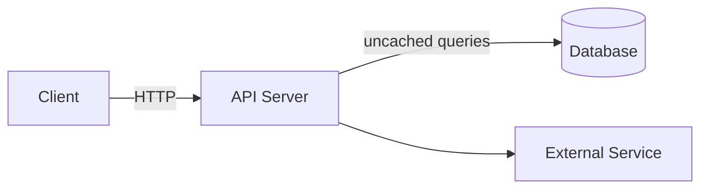
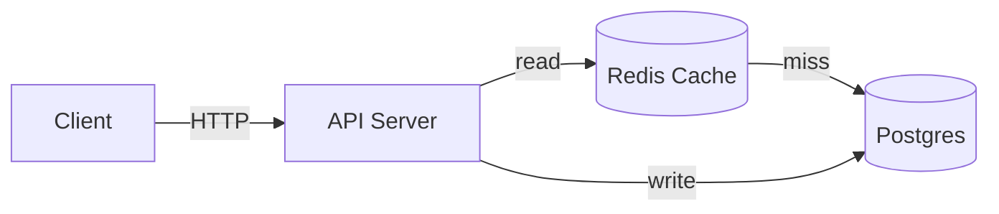
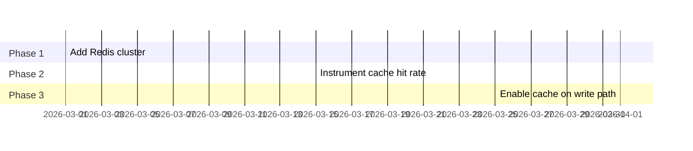

# [Replace: System Name]

**[Replace: One-sentence problem statement — specific and measurable]**

> Current state: [metric showing the problem — e.g., "47 timeouts/hour degrading p99 latency to 4.2s"]
> Proposed change: [what changes — e.g., "Re-enable query cache, add connection pooling"]
> Outcome: [specific result — e.g., "Eliminate timeouts, reduce p99 to under 800ms"]

<!--
Presenter notes: Open with the problem metric. Do not explain the solution yet.
Let the audience feel the problem before you reveal the fix.
-->

---

## System Context Drives the Problem

[Replace: Declarative assertion about why this problem exists in the current architecture]



- **Client**: [Describe — e.g., "Web frontend, ~2000 concurrent users at peak"]
- **API Server**: [Describe — e.g., "Stateless Phoenix app, 4 instances behind nginx"]
- **Database**: [Describe — e.g., "Postgres 15, single primary, no read replicas"]
- **External Service**: [Describe — e.g., "Third-party payment processor, p99 latency 200ms"]

<!--
Presenter notes: Walk through each component left to right.
Call out the bottleneck node — that is the focus of this deck.
-->

---

## Constraints Define the Solution Space

[Replace: Assertion about which constraints are non-negotiable]

| Constraint | Requirement | Rationale |
|-----------|------------|----------|
| [Replace: e.g., Consistency] | [Replace: e.g., Strong — no stale reads on checkout] | [Replace: e.g., Payment integrity requirement] |
| [Replace: e.g., Latency] | [Replace: e.g., p99 < 500ms] | [Replace: e.g., SLA with customer] |
| [Replace: e.g., Availability] | [Replace: e.g., 99.9% uptime] | [Replace: e.g., Current SLA] |
| [Replace: e.g., Migration] | [Replace: e.g., Zero downtime] | [Replace: e.g., 24/7 traffic, no maintenance window] |

<!--
Presenter notes: State tradeoffs explicitly.
"We chose X over Y because constraint Z is non-negotiable."
Engineers respect explicit tradeoffs more than vague "best practices."
-->

---

## Proposed Architecture Addresses All Constraints

[Replace: Assertion about what the new architecture achieves — specific to the constraints above]



- **Client**: [Same as before — no change from client perspective]
- **API Server**: [What changed — e.g., "Read-through cache logic added to context layer"]
- **Redis Cache**: [New component — e.g., "Read-through cache, 5-min TTL on product data, 16GB allocated"]
- **Postgres**: [How load changes — e.g., "Receives ~30% of previous read volume at current 70% cache hit rate"]

<!--
Presenter notes: Show the before/after contrast.
Use the same diagram structure so the audience can see exactly what changed.
-->

---

## Decision: [Replace: The Key Design Choice]

[Replace: Assertion naming the decision and its rationale — e.g., "Read-through cache chosen over write-through to avoid cache warming complexity"]

| Option | Pros | Cons | Verdict |
|--------|------|------|---------|
| [Replace: Option A — e.g., Read-through] | [Replace: e.g., No warming needed, lazy population] | [Replace: e.g., First-request latency unchanged] | Selected |
| [Replace: Option B — e.g., Write-through] | [Replace: e.g., Always warm on read] | [Replace: e.g., Write latency increases, cache invalidation complexity] | Rejected |
| [Replace: Option C — e.g., No cache] | [Replace: e.g., Simplest] | [Replace: e.g., Does not solve the timeout problem] | Rejected |

<!--
Presenter notes: Engineers will ask "why not X?"
Answer this before they ask. Show you considered alternatives.
-->

---

## Implementation: Three Phases

[Replace: Assertion about the phased approach and why phasing reduces risk]



- **Phase 1 (Mar 1-14)**: [Replace: what is done first and why it is lowest risk]
- **Phase 2 (Mar 15-28)**: [Replace: what monitoring or validation gates the next phase]
- **Phase 3 (Apr 1-14)**: [Replace: final cutover — what could go wrong and how it is mitigated]

<!--
Presenter notes: Engineers trust phased rollouts with explicit rollback plans.
State the rollback: "If Phase 2 shows cache hit rate below 40%, we stop and diagnose before Phase 3."
-->

---

## Risks and Mitigations

[Replace: Assertion acknowledging top risks and that they are planned for]

| Risk | Likelihood | Impact | Mitigation |
|------|-----------|--------|-----------|
| [Replace: e.g., Cache stampede on cold start] | [Replace: e.g., Low] | [Replace: e.g., High — brief latency spike] | [Replace: e.g., Staggered TTL jitter ±10% prevents simultaneous expiry] |
| [Replace: e.g., Redis instance failure] | [Replace: e.g., Low] | [Replace: e.g., High — fallback to Postgres] | [Replace: e.g., Circuit breaker falls back to direct DB query; Redis in HA mode] |
| [Replace: e.g., Stale data on cache hit] | [Replace: e.g., Medium] | [Replace: e.g., Medium — product data may lag 5min] | [Replace: e.g., Acceptable per product team; checkout always reads from Postgres] |

<!--
Presenter notes: Do not hide risks. Engineers will find them.
Showing you have thought through failure modes builds credibility.
-->

---

## Open Questions

[Replace: Assertion about what is not yet decided and when decisions are needed]

1. **[Replace: Question 1]** — [Replace: Who decides, what information is needed, by when]
2. **[Replace: Question 2]** — [Replace: Who decides, what information is needed, by when]
3. **[Replace: Question 3]** — [Replace: Who decides, what information is needed, by when]

**Requesting input on:**
- [Replace: Specific ask from this audience — e.g., "Cache TTL value — input from product team on acceptable data staleness"]
- [Replace: Specific ask — e.g., "Redis sizing — input from infra team on available capacity"]

<!--
Presenter notes: End with explicit questions.
Engineers who are not consulted become blockers.
Frame questions as decisions needed, not open-ended discussions.
-->

---
layout: center
---

## Appendix

*Technical deep dive — reference material for post-meeting review*

---

## Appendix: Key Code Changes

[Replace: Assertion about which code changes are central to the implementation]

```elixir {1-5|7-12|14-18}
# [Replace: Describe what these lines do]
defmodule MyApp.Cache do
  @ttl_seconds 300

  def get(key, fallback_fn) do
    # [Replace: describe the cache lookup strategy]
    case Redix.command(:redix, ["GET", key]) do
      {:ok, nil} ->
        value = fallback_fn.()
        Redix.command(:redix, ["SETEX", key, @ttl_seconds, encode(value)])
        value
      {:ok, cached} ->
        decode(cached)
    end
  end
end

# [Replace: Describe usage pattern]
def get_product(id) do
  Cache.get("product:#{id}", fn -> Repo.get!(Product, id) end)
end
```

- Lines 1-5: [Replace: explain what this block establishes]
- Lines 7-12: [Replace: explain the cache miss path and why it is structured this way]
- Lines 14-18: [Replace: explain the call site pattern — separation of cache logic from business logic]
