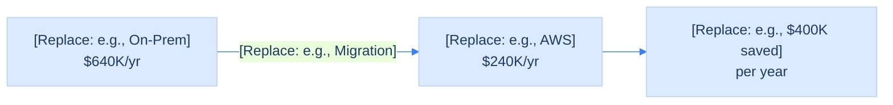

<!-- ASSERTION: 2 lines max, ~10-15 words, declarative sentence with a verb -->

  [Replace: Declarative assertion — e.g., "Migrating to AWS reduces annual cost by $400K and eliminates the 2027 hardware refresh"]

<!-- KEY METRICS: 3 callouts maximum -->

  

    
[Replace: e.g., $400K]

    
[Replace: e.g., Annual savings]

  

  

    
[Replace: e.g., 8mo]

    
[Replace: e.g., Migration timeline]

  

  

    
[Replace: e.g., 99.9%]

    
[Replace: e.g., Uptime maintained]

  

<!-- VISUAL EVIDENCE: occupies 60-70% of slide body -->
<!-- Replace the placeholder below with a mermaid diagram, chart, or table -->
<!-- Every diagram element MUST be labeled inline — no separate legend -->

<!-- DIAGRAM ANNOTATION: required for every diagram -->
- **[Replace: Left element]**: [Replace: what it represents — e.g., "Current on-premises infrastructure, $640K/year, approaching end-of-life"]
- **[Replace: Middle/transition]**: [Replace: what the arrow/process represents — e.g., "8-month phased migration, zero downtime"]
- **[Replace: Right element]**: [Replace: outcome — e.g., "AWS cloud infrastructure at $240K/year, scales to 4x current traffic"]

<!-- FOOTER: source and contact — kept to ≤5 words per field -->

  
Source: [Replace: e.g., "AWS TCO calculator, Mar 2026"]

  
[Replace: Owner name] · [Replace: email]

<!--
Word count target: ≤20 words total (assertion + metric labels + diagram labels)
Count: Replace all [Replace:] tokens and recount before sharing.

Export command:
  npx slidev export single-slide-overview.md --format png --output overview.png

For Slack/email: PNG is preferred (renders inline)
For presentation reference slide: include as last slide of a deck
-->
