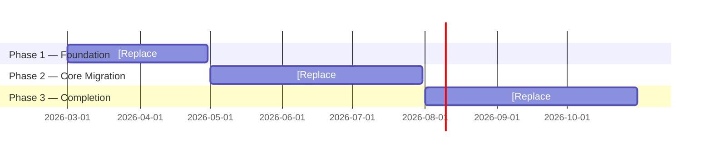

# [Replace: Initiative Name]

**[Replace: Declarative recommendation sentence — what you are asking for and the primary business outcome]**

> "We recommend [action] to [achieve outcome], delivering [specific benefit] by [date]."

<!--
Presenter notes: This is your governing thought. State it clearly in the first 30 seconds.
Do not build to a conclusion — lead with the conclusion.
-->

---

## The Cost of the Current State Is Growing

[Replace: Assertion quantifying the problem in business terms]

  

    
[Replace: e.g., $640K]

    
[Replace: e.g., Annual infrastructure cost]

  

  

    
[Replace: e.g., 2.3s]

    
[Replace: e.g., Average page load time]

  

  

    
[Replace: e.g., 4x]

    
[Replace: e.g., Projected traffic growth by Q4]

  

[Replace: 2-3 sentences connecting these metrics to business impact — customer experience, revenue risk, competitive position, or operational burden]

<!--
Presenter notes: Use the most impactful metric as the opening number.
Do not explain the technical cause here — that comes later.
Business stakeholders respond to cost, risk, and customer impact.
-->

---

## [Replace: Solution Name] Delivers [Replace: Primary Outcome]

[Replace: Assertion about what the solution achieves — outcome first, not mechanism]

  

    
[Replace: e.g., $400K]

    
[Replace: e.g., Annual cost reduction]

  

  

    
[Replace: e.g., 50%]

    
[Replace: e.g., Faster page loads for customers]

  

  

    
[Replace: e.g., 8mo]

    
[Replace: e.g., To full deployment]

  

**What changes for customers:**
- [Replace: Customer-facing outcome 1 — e.g., "Checkout loads in under 1 second on all devices"]
- [Replace: Customer-facing outcome 2 — e.g., "Product search returns results in under 500ms"]

**What changes for the business:**
- [Replace: Business outcome 1 — e.g., "Infrastructure cost drops from $640K to $240K per year"]
- [Replace: Business outcome 2 — e.g., "Hardware refresh cycle eliminated — no $2.4M renewal in 2027"]

<!--
Presenter notes: Keep mechanism language out of this slide.
"We are migrating to AWS" is mechanism. "We eliminate a $2.4M hardware refresh" is outcome.
-->

---

## The Business Case Is Positive Within [Replace: Timeframe]

[Replace: Assertion about ROI — specific numbers with stated methodology]

```mermaid
xychart-beta
    title "Cost comparison: current vs proposed ($K/year)"
    x-axis ["Year 1", "Year 2", "Year 3"]
    y-axis "Cost ($K)" 0 --> 700
    bar [640, 640, 640]
    bar [320, 240, 240]
```

- **Current trajectory** (blue): [Replace: describe the current cost trend — e.g., "$640K/year + $2.4M hardware refresh in Year 2"]
- **Proposed** (orange): [Replace: describe proposed cost — e.g., "$80K migration + $240K/year post-migration"]
- **Payback**: [Replace: e.g., "Migration cost recovered in 2.4 months of savings"]
- **Methodology**: [Replace: e.g., "AWS TCO calculator + 3-month average of current Azure billing (Jan-Mar 2026)"]

<!--
Presenter notes: Always state the methodology behind cost numbers.
"We used the AWS TCO calculator" is more credible than an unsourced figure.
Show year 3 to demonstrate the compounding benefit.
-->

---

## Implementation Requires [Replace: Duration] and [Replace: Budget]

[Replace: Assertion about what the plan requires and why phasing reduces risk]

- **Phase 1 ([Replace: dates])**: [Replace: what is done, what is validated, what gate must be passed to proceed]
- **Phase 2 ([Replace: dates])**: [Replace: what is done, stakeholder actions required — e.g., "IT security review needed by Month 3"]
- **Phase 3 ([Replace: dates])**: [Replace: final migration, when savings begin, decommission of old systems]

**Budget required**: [Replace: total and breakdown — e.g., "$80K one-time migration + $240K/year ongoing"]

<!--
Presenter notes: Identify any milestone that requires stakeholder action.
"IT security review needed by Month 3" is actionable. "Various approvals needed" is not.
-->

---

## Three Risks, Each With a Mitigation Plan

[Replace: Assertion that risks are identified and manageable]

| Risk | If It Occurs | Mitigation |
|------|-------------|-----------|
| [Replace: Risk 1 — business language] | [Replace: Business impact if it happens] | [Replace: Specific step taken to prevent or limit it] |
| [Replace: Risk 2 — business language] | [Replace: Business impact if it happens] | [Replace: Specific step taken to prevent or limit it] |
| [Replace: Risk 3 — business language] | [Replace: Business impact if it happens] | [Replace: Specific step taken to prevent or limit it] |

**Risk of inaction**: [Replace: What happens if no decision is made — e.g., "Hardware warranty expires Q3 2026; renewal quote is $2.4M or end-of-life risk"]

<!--
Presenter notes: Risk of inaction is often more persuasive than project risks.
Business stakeholders often delay decisions — show the cost of delay.
-->

---
layout: center
---

## One Decision Needed to Begin

[Replace: Assertion naming the single ask]

  [Replace: The exact decision — e.g., "Approve $80K migration budget"]

  Decision needed by: [Replace: date — e.g., "February 15, 2026"]

**If approved, next steps:**

1. [Replace: Immediate action — e.g., "Procurement kicks off AWS account setup (Week 1)"]
2. [Replace: Second milestone — e.g., "Phase 1 begins March 1"]
3. [Replace: Value delivery — e.g., "First cost savings realized November 1"]

**Questions**: [Replace: Owner name] · [Replace: email or contact]

<!--
Presenter notes: End with a single ask. Not "thoughts?", not "feedback?".
"We need budget approval by February 15 to hit the March 1 start date."
Name the decision-maker if they are in the room.
-->
