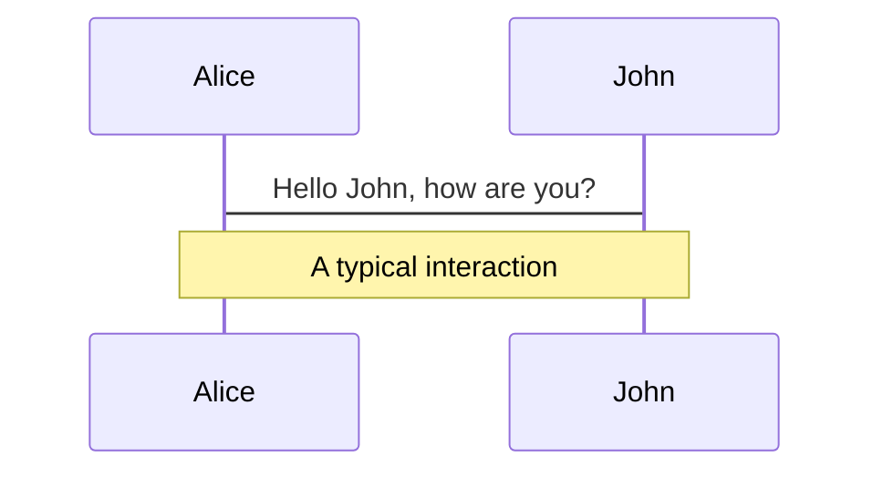
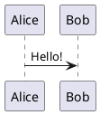

# Slidev Syntax Reference

## Slide Separators

Use `---` (three dashes) to separate slides:

```markdown
---
theme: default
---

# First Slide

Content here

---

# Second Slide

More content

---
layout: center
---

# Third Slide (centered)
```

The first `---` block is the **headmatter** (deck-level configuration). Subsequent `---` separators create new slides.

## Frontmatter

### Headmatter (Deck-Level)

The first frontmatter block configures the entire presentation:

| Property | Type | Default | Description |
|----------|------|---------|-------------|
| `theme` | string | `default` | Theme ID or npm package name |
| `title` | string | `Slidev` | Presentation title |
| `author` | string | — | Author name for exported files |
| `info` | string | `false` | Presentation description (Markdown) |
| `download` | boolean/string | `false` | Enable PDF download in SPA |
| `exportFilename` | string | `slidev-exported` | Export file name |
| `highlighter` | string | `shiki` | Code highlighter |
| `lineNumbers` | boolean | `false` | Show line numbers in code blocks |
| `monaco` | boolean/string | `true` | Enable Monaco editor |
| `twoslash` | boolean/string | `true` | Enable TwoSlash syntax |
| `mdc` | boolean | `false` | Enable MDC (Markdown Components) syntax |
| `colorSchema` | string | `auto` | Color scheme: `auto`, `light`, `dark` |
| `aspectRatio` | string | `16/9` | Slide aspect ratio |
| `canvasWidth` | number | `980` | Canvas width in pixels |
| `routerMode` | string | `history` | Vue Router mode: `history`, `hash` |
| `selectable` | boolean | `true` | Allow text selection |
| `record` | boolean/string | `dev` | Enable slide recording |
| `presenter` | boolean/string | `true` | Enable presenter mode |
| `transition` | string/object | — | Default slide transition |
| `fonts` | object | — | Google font configuration |
| `themeConfig` | object | — | Theme customization (CSS variables) |
| `defaults` | object | — | Default frontmatter for all slides |
| `drawings` | object | — | Drawing options |

### Per-Slide Frontmatter

Each slide can have its own frontmatter after a `---` separator:

```markdown
---
layout: center
transition: slide-up
clicks: 3
---
```

| Property | Type | Default | Description |
|----------|------|---------|-------------|
| `layout` | string | `cover`/`default` | Layout component name |
| `transition` | string/object | — | Slide transition |
| `clicks` | number | `0` | Custom click animation count |
| `clicksStart` | number | `0` | Custom starting click count |
| `disabled` | boolean | `false` | Disable and hide slide |
| `hide` | boolean | `false` | Alias for `disabled` |
| `hideInToc` | boolean | `false` | Hide from table of contents |
| `level` | number | `1` | Title level for TOC |
| `preload` | boolean | `true` | Pre-mount slide before entry |
| `routeAlias` | string | — | URL route alias |
| `src` | string | — | Import external Markdown file |
| `title` | string | — | Override slide title |
| `zoom` | number | `1` | Custom zoom scale |

### Block Frontmatter

Alternative syntax using a YAML code fence for better editor support:

````markdown
---

```yaml
layout: quote
```

# Slide with block frontmatter
````

Block frontmatter provides syntax highlighting and formatter compatibility. Cannot be used for the deck-level headmatter.

## Built-in Layouts

### Layouts Without Props

| Layout | Purpose |
|--------|---------|
| `default` | Basic layout for any content |
| `center` | Centers content on screen |
| `cover` | Cover/title page |
| `intro` | Introduction page with title |
| `section` | Section divider |
| `statement` | Statement or affirmation |
| `quote` | Prominent quotation |
| `fact` | Prominent fact or data |
| `full` | Full-screen content (no padding) |
| `end` | Final slide |
| `none` | No styling at all |

### Layouts With Props

**`image`** — Full-screen background image:
```yaml
---
layout: image
image: /path/to/image.png
backgroundSize: contain  # default: "cover"
---
```

**`image-left`** / **`image-right`** — Image on one side, content on the other:
```yaml
---
layout: image-left
image: /path/to/image.png
class: my-custom-class  # optional: class for content area
---
```

**`iframe`** — Embedded web page:
```yaml
---
layout: iframe
url: https://example.com
---
```

**`iframe-left`** / **`iframe-right`** — Iframe on one side, content on the other:
```yaml
---
layout: iframe-right
url: https://example.com
class: my-custom-class
---
```

### Layouts With Named Slots

**`two-cols`** — Two-column layout:
```markdown
---
layout: two-cols
---

# Left Column

Content on the left

::right::

# Right Column

Content on the right
```

**`two-cols-header`** — Header spanning both columns, then two columns:
```markdown
---
layout: two-cols-header
---

This header spans both columns

::left::

# Left

Content here

::right::

# Right

Content here
```

### Slot Sugar Syntax

Use `::name::` markers for named slots instead of `<template v-slot:name>`:

```markdown
::right::
# Right side content

::default::
# Left side content (explicit default slot)
```

Content before any `::name::` marker fills the default slot. Slot order in source does not affect rendering order.

## Presenter Notes

Add notes below `<!--` comment markers at the bottom of a slide:

```markdown
---

# My Slide

Slide content here

<!--
Speaker notes go here.
They are visible in presenter mode but not in the presentation.

**Markdown** is supported in notes.
-->
```

Access presenter mode by appending `/presenter` to the URL or clicking the presenter icon.

## Click Animations

### v-click Directive

Show elements on click:

```markdown
<v-click>

This appears after one click

</v-click>
```

### Multiple Clicks

```markdown
<v-click>Item 1</v-click>
<v-click>Item 2</v-click>
<v-click>Item 3</v-click>
```

### v-click on Lists

```markdown
<v-clicks>

- Item 1
- Item 2
- Item 3

</v-clicks>
```

### Custom Click Count

Set the total number of clicks for a slide:

```yaml
---
clicks: 5
---
```

## Transitions

### Built-in Transitions

Set transitions in frontmatter:

```yaml
---
transition: slide-left
---
```

Available transitions: `fade`, `fade-out`, `slide-left`, `slide-right`, `slide-up`, `slide-down`.

### Per-Slide Transition

```yaml
---
transition: fade
---

# Slide with fade transition
```

### Global Default Transition

Set in the headmatter:

```yaml
---
transition: slide-left
---
```

## MDC Syntax (Markdown Components)

Enable with `mdc: true` in headmatter. Allows using Vue components with a Markdown-friendly syntax:

```markdown
::component-name{prop1="value" prop2="value"}
Content
::
```

Required for features like code groups.

## LaTeX Math

### Inline Math

```markdown
$\sqrt{3x-1}+(1+x)^2$
```

### Block Math

```markdown
$$
\begin{aligned}
\nabla \cdot \vec{E} &= \frac{\rho}{\varepsilon_0} \\
\nabla \cdot \vec{B} &= 0
\end{aligned}
$$
```

Powered by KaTeX. Line highlighting with `{1|3|all}` syntax is supported in block math.

## Diagrams

### Mermaid

````markdown

````

### PlantUML

````markdown

````

Uses `plantuml.com` server by default. Configure with `plantUmlServer` in headmatter.

## Draggable Elements

Position elements interactively:

```markdown
---
dragPos:
  square: 100,100,200,200,0
---


```

Or use the `<v-drag>` component:

```markdown
<v-drag pos="100,100,200,200,0">
  Draggable content
</v-drag>
```

## Importing Slides

Import slides from external Markdown files:

```yaml
---
src: ./pages/intro.md
---
```

Or use the `src` frontmatter property on a slide separator.
